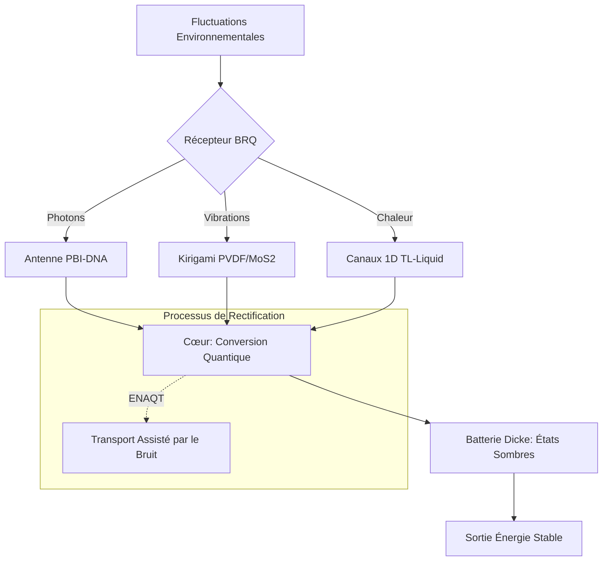

# 🌿 BRQ-BioHarvest-Engine (Bio-Resonant Quantum System)

## 📖 Synopsis
Le système **BRQ** représente une rupture majeure avec les modèles thermodynamiques centralisés du début du XXIe siècle. En fusionnant la biologie quantique, la science des matériaux et la physique des états hors-équilibre, cette architecture permet d'extraire de l'énergie à partir du "désordre" environnemental (fluctuations thermiques, micro-vibrations, lumière diffuse). 

Conçu comme une structure foliacée synthétique, le BRQ utilise des antennes photoniques à base d'ADN et de colorants PBI pour transporter l'énergie avec une efficacité quasi-parfaite via la cohérence quantique.

## ⚛️ Formalisme Mathématique

### 1. Efficacité de Conversion (Limite Hors-Équilibre)
[cite_start]Contrairement aux cycles classiques limités par Carnot, le convertisseur à liquide de Tomonaga-Luttinger (TL) exploite des distributions de Fermi binaires pour dépasser la limite de Curzon-Ahlborn:

$$\eta > 1 - \sqrt{\frac{T_c}{T_h}}$$

Où $T_c$ et $T_h$ sont les températures des réservoirs froid et chaud. [cite_start]La force électromotrice générée est $2$ à $3$ fois supérieure aux convertisseurs classiques.

### 2. Dynamique des Batteries Quantiques (Modèle de Dicke)
[cite_start]Le stockage repose sur la super-absorption dans une microcavité, où la puissance de charge $P$ augmente de manière super-linéaire avec le nombre de cellules $N$:

$$P \propto N^2$$

La rétention est assurée par le transfert vers des états triplets sombres protégés de la décohérence.

## 🗺️ Architecture du Système (Mermaid)

## 📊 Prédictions & Métrologie (Performance 2025-2026)

| Paramètre | Mécanisme | Performance (BRQ) | Limite Classique |
| --- | --- | --- | --- |
| **Efficacité Transport** | Cohérence Quantique | Quasi-parfaite (60 fs) 

 | Transfert FRET (Dissipatif) |
| **Déformation Élastique** | Kirigami PVDF | 220% 

 | < 10% (Rigide) |
| **Rétention Énergie** | Dark Triplet States

 | x1000 

 | µs (Singlets) |
| **Densité Courant** | MoS2 TENG | µA / goutte de pluie 

 | Négligeable |

## 🚀 Applications & Roadmap

* 
**Court terme (2026)** : Alimentation passive de capteurs IoT et dispositifs médicaux implantables.

* 
**Moyen terme** : Enveloppes de bâtiments bio-inspirées et adaptatives (Phyllotaxie synthétique).

* 
**Long terme** : Infrastructure énergétique décentralisée "post-fossilienne" totalement autonome.

